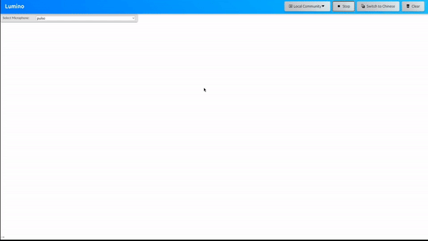

## DECO3801 Lumino
**Lumino** is an AI-powered translation web service designed specifically for elderly Chinese immigrants living in Australia. Aimed at bridging language barriers, Lumino offers context-aware translation services that account for the intricacies and colloquialisms of both English and Chinese. The application facilitates seamless communication through features like speech recognition and transcription, utilizing technologies such as SpeechRecognition and OpenAI's Whisper. Translation is powered by DeepL, while context generation is handled by Google Gemini, ensuring users receive relevant and accurate translations. Lumino is thoughtfully crafted to assist elderly users in essential scenarios, including medical appointments and interactions with social services.


## Library Requirements
```bash
pip install -r requirements.txt
```

Lumino makes use of:
- SpeechRecognition
- pyaudio
- Flask
- flask-socketio
- setuptools
- pyaudio
- deep_translator
- deepl
- numpy
- openai_whisper
- torch 
- google-generativeai

If issues occur, remove the strict version requirement in requirements.txt and install the latest version of each package

## Usage

- web/lumino.py: This file contains all the core functionality of the application. You can run it independently for testing purposes.

- web/app.py: This is the main file that serves the Flask web application. It connects all the functionalities together and manages user interactions.

- speech.py: A standalone program that handles speech recognition and transcription. It can be run independently for testing.

- translate.py: A standalone program for translating text. This can also be executed separately for testing.

- generate.py: This standalone program is responsible for generating AI context. Like the others, it can be run on its own for testing.

### API Requirements
To use the generative LLM features, an API key is required. Currently, Google’s Gemini is implemented, with support for OpenAI and Anthropic as well.
Translation:
- DeepL requires an API key for use.
- Google Translate does not require an API key.

## Installation instructions
Python v3.12.x is recommended version of python. It is also highly recommended to create a new venv to run this application
```
python3 -m venv <venvname>
source <venvname>/bin/activate
```

For microphone recognition, pyaudio must be installed. This is highly dependent on OS.
- On windows
  - `pip install pyaudio`
- On OSX
  - `brew install portaudio` followed by `pip install pyaudio`
- On Linux, pulseaudio is highly recommended
  - `sudo apt-get install pulseaudio`   
  - `sudo apt-get install portaudio19-dev python-all-dev python3-all-dev && sudo pip3 install pyaudio`
 
Furthermore, the available and selected microphones are highly device dependent so some modifications may be required.
```python
import speech_recognition as sr

sr.Microphone.list_working_microphones()
sr.Microphone.list_microphone_names()
```
This gives a list of which microphones are active and the position of all microphones. 
Line 38 of Lumino.py may need to be adapted to 
```python
self.source = sr.Microphone(i)
```
where `i` is the index position of desired microphone. Typically, `self.source = sr.Microphone()` should suffice, but this is not guaranteed. 

